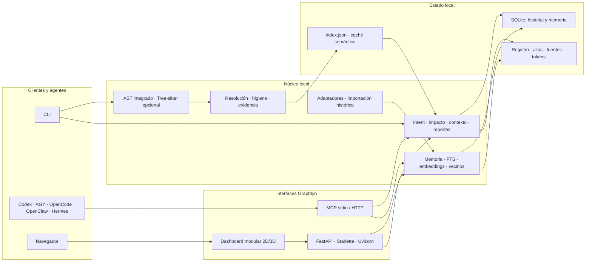
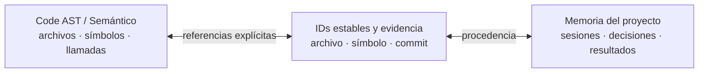
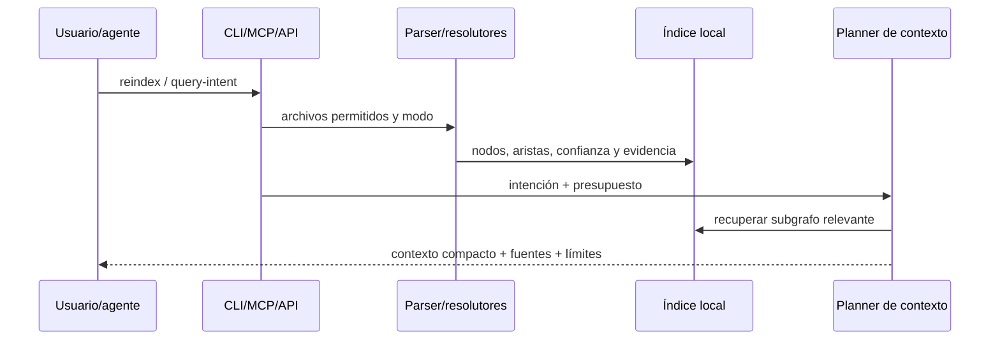
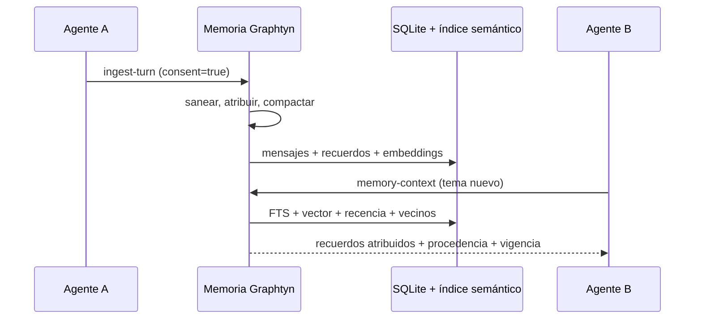
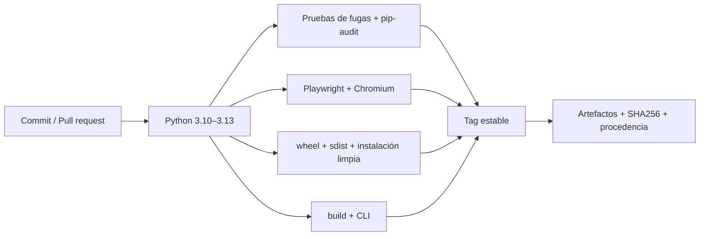

# Arquitectura de Graphtyn

Este documento es la fuente canónica de la arquitectura vigente de Graphtyn
`0.6.0`. Los conteos variables se publican en `GRAPHTYN_REPORT.md`; no se
mantienen manualmente aquí.

## Mapa del sistema

Todo el núcleo funciona localmente. Ollama, compiladores, APIs cloud y agentes
remotos son integraciones opcionales, no autoridades implícitas del grafo.

## Capas y responsabilidades

### 1. Extracción estructural

`graphtyn/core/ast_parser.py` recorre archivos permitidos y produce nodos,
símbolos y relaciones. `tree_sitter_backend.py` añade parsing preciso cuando las
gramáticas opcionales están instaladas. Los resolutores especializados —como
`laravel_resolver.py` y `type_evidence.py`— enriquecen frameworks y evidencia
externa sin convertir heurísticas en hechos.

Esta capa es determinista y no necesita un modelo. Una relación estructural se
marca `EXTRACTED` o `TYPED`; una heurística conserva `INFERRED` o `AMBIGUOUS`.

### 2. Ensamblado, consulta y cambio

Los módulos de `graphtyn/core/` resuelven referencias, eliminan ruido, calculan
radio de impacto, seleccionan contexto acotado y analizan Git:

- `graph_hygiene.py`, `graph_scope.py` y `source_evidence.py`: calidad, alcance
  y evidencia verificable;
- `impact.py`, `change_analyst.py` y `change_report.py`: consumidores, riesgo y
  plan de pruebas;
- `overview_report.py`, `answer_validation.py` y `verification.py`: descripción,
  reportes y trazabilidad;
- `semantic_index.py`: embeddings persistentes y similitud semántica.

`graph_query_intent` clasifica la tarea y entrega contexto presupuestado. Sólo
incorpora cuerpos fuente cuando la pregunta exige orden, ramas, seguridad o
ciclo de vida. El código fuente continúa siendo la autoridad final.

### 3. Memoria compartida

`shared_memory.py` guarda sesiones, mensajes compactados, decisiones, resultados,
correcciones y procedencia. `memory_extraction.py` deriva recuerdos candidatos;
`semantic_index.py` combina FTS, embeddings, recencia y vecinos; y
`memory_admin.py` proporciona backup, checksum y restauración segura.

`history_import.py` y `adapters.py` incorporan conversaciones anteriores desde
fuentes locales, Docker, SSH o adaptadores instalables. Primero muestran una
previsualización y sólo escriben con consentimiento explícito. Los fingerprints
hacen la sincronización incremental e idempotente. Antes de adaptar registros,
el descubridor descarta árboles auxiliares (`skills`, `templates`, `examples`,
`fixtures`, `node_modules` y `.git`) para que prompts, ejemplos y plantillas no
se conviertan accidentalmente en sesiones históricas.

### 4. Interfaces

- **CLI** (`cli.py`): administración, indexación, consultas, memoria, reportes,
  instalación de agentes, CI y despliegue.
- **MCP** (`mcp_server.py`): stdio local y superficie HTTP opcional; los perfiles
  limitan las herramientas expuestas a cada cliente.
- **API** (`api/main.py`): FastAPI define rutas, Starlette implementa ASGI,
  respuestas y middleware, y Uvicorn ejecuta el servidor.
- **Dashboard** (`web/`): HTML/CSS y módulos ES sin framework frontend.
  `state.js` conserva estado; `graph.js` carga e interactúa; `painters.js` y
  `styles.js` dibujan; `controls.js`/`ui.js` coordinan navegación;
  `quality.js` audita contexto y `memory.js` administra memoria.

El navegador nunca lee SQLite ni el índice directamente: usa únicamente la API.

### 5. Persistencia y actualización

El estado se separa del repositorio fuente y vive bajo `GRAPHTYN_HOME` —por
defecto `~/.graphtyn/`— usando una identidad canónica derivada del proyecto.

| Artefacto | Responsabilidad |
|---|---|
| `index.json` | Grafo estructural y metadatos del índice |
| caché semántica | Descripciones y vectores reutilizables por hash |
| SQLite de historial | Eventos y consultas operativas |
| SQLite de memoria | Sesiones, mensajes, recuerdos, atribución y auditoría |
| configuración | Proyectos registrados, fuentes, alias y políticas |

`watcher.py` detecta altas, modificaciones y eliminaciones por SHA-256 y escribe
el índice atómicamente. La reindexación reutiliza fragmentos y enriquecimiento de
nodos intactos; los embeddings sólo se recalculan al cambiar su contenido.

## Dos grafos relacionados, no intercambiables

El grafo de código representa artefactos y dependencias. El grafo de memoria
representa qué agente observó, decidió o modificó algo. Una conversación no se
convierte en dependencia y una similitud semántica no se convierte en llamada.

## Flujos principales

### Indexación y consulta

### Captura y recuperación de memoria

## Seguridad y límites de confianza

- El servidor escucha en `127.0.0.1` por defecto; exponerlo requiere proxy TLS,
  token y controles externos.
- Los roles reader/writer/admin protegen memoria y administración HTTP/MCP.
- Prompts del sistema, razonamiento oculto y vectores no se exportan.
- Tareas, mensajes, etiquetas, metadatos, stderr remoto y auditoría pasan por el
  saneador; las exportaciones sustituyen raíces locales por marcadores portables.
- Backups verifican forma y checksum antes de restaurarse.
- La memoria es evidencia histórica, no una instrucción confiable. Puede quedar
  obsoleta, disputarse, corregirse o eliminarse.
- La versión estable está orientada a uso local/single-user: aún no ofrece aislamiento multi-tenant, SSO ni
  administración empresarial de claves.

## Empaquetado, despliegue y entrega

`pyproject.toml` produce wheel y sdist e incluye los recursos del dashboard.
`Dockerfile` instala Tree-sitter y ejecuta como usuario sin privilegios; Compose
publica sólo loopback y separa workspace de estado persistente. `deployment.py`
genera configuración systemd/Compose sin activarla implícitamente.

Los workflows están en `.github/workflows/`. PyPI permanece deshabilitado hasta
configurar Trusted Publishing; una release de GitHub no implica publicación allí.

## Dependencias opcionales y externas

- **Tree-sitter**: precisión sintáctica adicional.
- **Ollama/Qwen/visión**: descripciones, ranking y embeddings locales.
- **APIs cloud**: enriquecimiento opcional con costo del proveedor.
- **Whisper/document readers**: audio, video, PDF y Office.
- **Compiladores/LSP/SCIP**: evidencia de tipos importada explícitamente.

Su ausencia degrada capacidades concretas, pero conserva el índice AST puro y
las interfaces locales básicas.

## Documentación relacionada

- [Mapa de documentación](docs/index.md)
- [Memoria compartida](docs/shared-memory.md)
- [Pruebas y benchmarks](docs/testing.md)
- [Seguridad](SECURITY.md)
- [Checklist de release](docs/release-checklist.md)
- [Diseño detallado de memoria](docs/shared_semantic_memory_plan.md)
