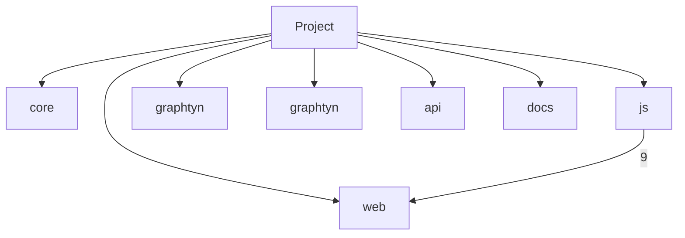

# GRAPHTYN REPORT — graphtyn

## Purpose
El motor de mapa topológico de código, registro de sesiones local y servidor MCP estándar para Agentes de IA (Google Antigravity, Claude Code, Codex, Cursor y Windsurf).

## Technology profile
- Languages: Python, JavaScript
- Frameworks/tools: FastAPI, Tree-sitter, Uvicorn, pytest
- Manifests: pyproject.toml

## Entry points
- `graphtyn/cli.py`
- `graphtyn/api/main.py`

## Architecture

## Representative flows
- **scan_directory** —llama→ **_tree_facts** [EXTRACTED] · `graphtyn/core/ast_parser.py:357`
- **scan_directory** —llama→ **_add_tree_symbols** [EXTRACTED] · `graphtyn/core/ast_parser.py:359`
- **visit** —llama→ **_text** [EXTRACTED] · `graphtyn/core/tree_sitter_backend.py:151`

## Risk and technical-debt signals
- **ambiguous_relations** (medium): 6 (usa: 6) Requieren verificación; no prueban un defecto.
- **high_connectivity_hotspots** (review): scan_directory, visit, handle_request, loadGraph, _enrich_with_ai Alta conectividad implica mayor radio potencial, no deuda confirmada.

## Key symbols
- `HistoryTracker`
- `WatchManager`
- `handle_request`
- `loadGraph`
- `_enrich_with_ai`
- `apply3DStyle`
- `_text`
- `onNodeClick`

## Report metrics
- estimated_tokens: `362`
- selected_source_tokens: `10737`
- observable_coverage: `1.0`
- reduction_vs_selected_source: `0.9663`
- quality_note: `Coverage compares observable dimensions/headings, not ground-truth semantic correctness.`
