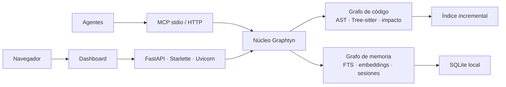

# 🌌 Graphtyn

[](docs/CHANGELOG.md)
[](LICENSE)
[](https://www.python.org/)
[](https://modelcontextprotocol.io/)

Graphtyn crea un grafo local y auditable del código, calcula impacto y entrega
contexto compacto a agentes mediante MCP. También conserva memoria semántica
compartida entre sesiones y agentes sin mezclar conversaciones con dependencias
estructurales.

> Versión estable `0.6.0`, orientada a uso local y single-user. TLS, SSO y
> aislamiento multi-tenant no forman parte de esta versión. Graphtyn aún no está
> publicado en PyPI.

**Documentación:** [índice completo](docs/index.md) ·
[arquitectura](docs/ARCHITECTURE.md) · [memoria](docs/shared-memory.md) ·
[pruebas](docs/testing.md) · [benchmarks](docs/BENCHMARKS.md) ·
[seguridad](docs/SECURITY.md)

## Qué ofrece

- Grafo determinista de archivos, símbolos, llamadas, herencia y relaciones de
  framework, con evidencia `EXTRACTED`, `INFERRED` o `AMBIGUOUS`.
- Tree-sitter opcional para C#, JavaScript, TypeScript/TSX, Python, Java, Go,
  Rust y PHP; extractor integrado para otros lenguajes y activos de Unity.
- Radio de impacto para símbolos, cambios locales, ramas y pull requests.
- Contexto por intención y presupuesto para evitar lecturas masivas del
  repositorio.
- Memoria compartida con SQLite, búsqueda híbrida FTS + embeddings, atribución
  por agente, importación histórica y deduplicación.
- Dashboard 2D/3D en `http://127.0.0.1:9210`, API y servidor MCP stdio/HTTP.
- Indexación incremental: después del primer índice sólo procesa cambios y
  reutiliza la caché estructural y semántica.
- Código, índice y memoria locales por defecto; la IA local o cloud es opcional.

## Arquitectura en un minuto



Son dos grafos vinculados mediante referencias explícitas: el de código modela
la estructura del repositorio y el de memoria conserva hechos, decisiones y
procedencia. El diseño completo está en
[docs/ARCHITECTURE.md](docs/ARCHITECTURE.md).

## Instalación rápida

Graphtyn aún no está publicado en PyPI. Desde un checkout del repositorio:

```bash
python -m venv .venv
source .venv/bin/activate
python -m pip install -e '.[treesitter]'
graphtyn setup --path . --apply
graphtyn serve --path .
```

El dashboard anuncia su URL al arrancar y escucha por defecto sólo en
`127.0.0.1:9210`. Para mantenerlo disponible al iniciar sesión:

```bash
graphtyn service install --path . --enable
graphtyn service status
```

En Windows, descargue `install.ps1` y el wheel de la misma versión, colóquelos
en la misma carpeta y ejecute PowerShell:

```powershell
Set-ExecutionPolicy -Scope Process Bypass
.\install.ps1 -ProjectPath "C:\ruta\al\proyecto"
```

El instalador es por usuario, configura Graphtyn, registra el dashboard y abre
`http://127.0.0.1:9210`. Consulte instalación, Docker, VPS y desinstalación en
[la guía de operación](docs/ARCHITECTURE.md#empaquetado-despliegue-y-entrega).

Extras opcionales:

```bash
python -m pip install -e '.[multimodal]'
python -m pip install -e '.[media]'
```

## Flujo habitual

```bash
# Crear o actualizar el índice
graphtyn reindex --mode fast --path .
graphtyn serve --watch --path .

# Entender el repositorio y obtener contexto acotado
graphtyn query-intent "¿De qué trata este repositorio?" --intent overview --path .
graphtyn context GameManager PlayerService --depth 1 --limit 12 --path .

# Planificar y verificar cambios
graphtyn analyze-change "Cambiar el flujo de autenticación" --path .
graphtyn diff --path .
graphtyn pr-impact --path . --base main
graphtyn verify-edit --base HEAD~1 --json --path .

# Generar artefactos persistentes
graphtyn export-md --path .
graphtyn report --path . --output GRAPHTYN_REPORT.md
```

Modos de reindexación:

| Modo | Uso |
|---|---|
| `fast` | AST determinista, rápido y sin LLM |
| `balanced` | Añade enriquecimiento local selectivo |
| `deep` | Mayor cobertura semántica |
| `verified` | Análisis profundo con verificaciones disponibles |

Use `graphtyn --help` y `graphtyn <comando> --help` como referencia exacta de
opciones. La [documentación completa](docs/index.md) agrupa los flujos avanzados
sin convertir esta portada en un manual.

## Integración con agentes

Instale instrucciones y configuración MCP sin modificar el código del proyecto:

```bash
graphtyn agent-install all --path .
graphtyn mcp
```

El repositorio incluye [AGENTS.md](AGENTS.md) para descubrimiento automático y
una [skill reutilizable](skills/graphtyn/SKILL.md). El patrón recomendado es:

1. Pedir a Graphtyn un `overview`, `context`, `flow` o `impact` según la tarea.
2. Leer sólo los puntos de entrada y fragmentos devueltos.
3. Implementar el cambio.
4. Reconsultar impacto y ejecutar las pruebas relevantes.
5. Guardar únicamente decisiones o resultados útiles en memoria.

Ejemplo de prompt:

> Usa Graphtyn para localizar el flujo afectado, entrega evidencia de archivos y
> símbolos, implementa el cambio y vuelve a medir el radio de impacto. No leas el
> repositorio completo si el contexto acotado es suficiente.

## Memoria compartida

La memoria es opt-in, se almacena por proyecto y puede compartirse entre Codex,
OpenCode, Antigravity, OpenClaw, Hermes u otros clientes MCP:

```bash
graphtyn memory session-start --agent-id opencode --path .
graphtyn memory checkpoint --agent-id opencode --kind decision \
  --text "Se conservó compatibilidad con el formato anterior" --path .
graphtyn memory session-end --agent-id opencode --summary "Cambio verificado" --path .
```

Las conversaciones anteriores pueden importarse mediante autodetección,
manifiestos adaptadores o archivos exportados. Graphtyn sanea secretos,
deduplica eventos y conserva procedencia; no intercepta conversaciones sin una
integración explícita. Configuración, recuperación, backups y ejemplos están en
[docs/shared-memory.md](docs/shared-memory.md).

## Dashboard y API

```bash
graphtyn serve --host 127.0.0.1 --port 9210 --path .
```

El dashboard separa diseño del grafo, motor de índice, filtros y operación.
Incluye vistas para código, semántica, memoria del proyecto, cerebros de agentes,
impacto, calidad del índice y contexto para agentes. No exponga el puerto a una
red pública sin autenticación y TLS.

Para automatización remota use MCP HTTP con tokens por rol y proyecto:

```bash
graphtyn token rotate --role admin --path .
graphtyn mcp --transport http --host 127.0.0.1 --port 9211 --path .
```

Consulte contratos y límites operativos en
[docs/ARCHITECTURE.md](docs/ARCHITECTURE.md) y [docs/SECURITY.md](docs/SECURITY.md).

## Calidad y benchmarks

Las afirmaciones públicas se basan en artefactos reproducibles. Los resultados
separan calidad, recall, tokens del contexto y tokens end-to-end; no presentan
compresión de corpus como ahorro facturado ni extrapolan una prueba parcial a
todos los repositorios.

```bash
python -m pytest -q
graphtyn benchmark --path . --ground-truth benchmarks/ground_truth.json \
  --output resultado.json
graphtyn benchmark-suite --protocol benchmarks/statistical_protocol_36_tasks.json
```

Resultados, hardware, metodología y comparaciones anonimizadas:
[docs/BENCHMARKS.md](docs/BENCHMARKS.md). Protocolo de verificación:
[docs/testing.md](docs/testing.md).

## Documentación

| Tema | Documento |
|---|---|
| Arquitectura y despliegue | [docs/ARCHITECTURE.md](docs/ARCHITECTURE.md) |
| Memoria multiagente | [docs/shared-memory.md](docs/shared-memory.md) |
| Dashboard | [docs/ui_ux_specification.md](docs/ui_ux_specification.md) |
| Pruebas | [docs/testing.md](docs/testing.md) |
| Benchmarks | [docs/BENCHMARKS.md](docs/BENCHMARKS.md) |
| Estudio de mercado | [docs/market-study.md](docs/market-study.md) |
| Seguridad | [docs/SECURITY.md](docs/SECURITY.md) |
| Contribución | [docs/CONTRIBUTING.md](docs/CONTRIBUTING.md) |
| Cambios | [docs/CHANGELOG.md](docs/CHANGELOG.md) |

## Alcance de la versión

Graphtyn está listo para uso público local y automatización controlada. Aún no
ofrece control empresarial multi-tenant, SSO, alta disponibilidad ni una
afirmación universal de superioridad frente a otras herramientas. Esos límites
se mantienen explícitos para que cada adopción pueda evaluar el producto con su
propio repositorio y ground truth.

## Licencia

[MIT](LICENSE)
