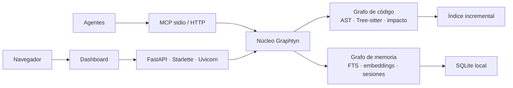

# 🌌 Graphtyn

[](docs/CHANGELOG.md)
[](LICENSE)
[](https://www.python.org/)
[](https://modelcontextprotocol.io/)

Graphtyn crea un grafo local y auditable del código, calcula impacto y entrega
contexto compacto a agentes mediante MCP. También conserva memoria semántica
compartida entre sesiones y agentes sin mezclar conversaciones con dependencias
estructurales.

> Última versión estable publicada: `0.7.0`. La rama actual prepara `0.8.0`;
> sus cambios no se publicarán hasta que pase la CI requerida. Graphtyn se
> distribuye por GitHub Releases; PyPI permanece deshabilitado. El despliegue es
> self-hosted: los agentes pueden compartir memoria con permisos por token y
> proyecto, pero no es un servicio SaaS multi-tenant.

**Documentación:** [índice completo](docs/index.md) ·
[arquitectura](docs/ARCHITECTURE.md) · [memoria](docs/shared-memory.md) ·
[conexión OpenClaw](docs/openclaw-native.md) ·
[pruebas](docs/testing.md) · [benchmarks](docs/BENCHMARKS.md) ·
[seguridad](docs/SECURITY.md)

## Qué ofrece

- Grafo determinista de archivos, símbolos, llamadas, herencia y relaciones de
  framework, con evidencia `EXTRACTED`, `INFERRED` o `AMBIGUOUS`.
- Tree-sitter opcional para C#, JavaScript, TypeScript/TSX, Python, Java, Go,
  Rust y PHP; extractor integrado para otros lenguajes y activos de Unity.
- Radio de impacto para símbolos, cambios locales, ramas y pull requests.
- Contexto por intención y presupuesto para evitar lecturas masivas del
  repositorio.
- Memoria compartida con SQLite, búsqueda híbrida FTS + embeddings, atribución
  por agente, importación histórica y deduplicación.
- Dashboard 2D/3D en `http://127.0.0.1:9210`, API y servidor MCP stdio/HTTP.
- Indexación incremental: después del primer índice sólo procesa cambios y
  reutiliza la caché estructural y semántica.
- Código, índice y memoria locales por defecto; la IA local o cloud es opcional.

## Arquitectura en un minuto



Son dos grafos vinculados mediante referencias explícitas: el de código modela
la estructura del repositorio y el de memoria conserva hechos, decisiones y
procedencia. El diseño completo está en
[docs/ARCHITECTURE.md](docs/ARCHITECTURE.md).

## Instalación rápida

Graphtyn aún no está publicado en PyPI. Desde un checkout del repositorio:

```bash
python -m venv .venv
source .venv/bin/activate
python -m pip install -e '.[treesitter]'
graphtyn onboard --path . --agent antigravity --tool-profile full
graphtyn serve --path .
```

El dashboard anuncia su URL al arrancar y escucha por defecto sólo en
`127.0.0.1:9210`. Para mantenerlo disponible al iniciar sesión:

```bash
graphtyn service install --path . --enable
graphtyn service status
```

En Windows, descargue `install.ps1` y el wheel de la misma versión, colóquelos
en la misma carpeta y ejecute PowerShell:

```powershell
Set-ExecutionPolicy -Scope Process Bypass
.\install.ps1 -ProjectPath "C:\ruta\al\proyecto"
```

El instalador es por usuario, crea el primer índice, configura Graphtyn,
registra el dashboard y abre
`http://127.0.0.1:9210`. Consulte instalación, Docker, VPS y desinstalación en
[la guía de operación](docs/ARCHITECTURE.md#empaquetado-despliegue-y-entrega).

Extras opcionales:

```bash
python -m pip install -e '.[multimodal]'
python -m pip install -e '.[media]'
```

## Flujo habitual

```bash
# Crear o actualizar el índice
graphtyn reindex --mode fast --path .
graphtyn serve --watch --path .

# Entender el repositorio y obtener contexto acotado
graphtyn query-intent "¿De qué trata este repositorio?" --intent overview --path .
graphtyn context GameManager PlayerService --depth 1 --limit 12 --path .

# Planificar y verificar cambios
graphtyn analyze-change "Cambiar el flujo de autenticación" --path .
graphtyn diff --path .
graphtyn pr-impact --path . --base main
graphtyn verify-edit --base HEAD~1 --json --path .

# Generar artefactos persistentes
graphtyn export-md --path .
graphtyn report --path . --output GRAPHTYN_REPORT.md
```

Configuración y memoria conversacional:

```bash
# Configurar el proyecto y preguntar si se activa memoria
graphtyn setup --apply --memory ask
# Activar memoria sin interacción (instaladores y CI)
graphtyn setup --apply --memory on --memory-watch
# Importar o sincronizar historiales autorizados
graphtyn memory bootstrap --path .
graphtyn memory sync --path . --watch --interval 5 --consent
graphtyn memory sync --all-spaces --consent
graphtyn memory status --path .
```

`--memory off` instala Graphtyn sin captura conversacional. `bootstrap` siempre
ofrece primero una vista previa; la importación histórica requiere repetirla con
`--apply --consent`.

Los cerebros `LEGADO` se muestran separados como archivos históricos. Para
incorporar el historial al cerebro activo de cada agente, usa
`graphtyn memory consolidate --source <archivo> --target <cerebro> --agent-id <identidad>`
para revisar la vista previa; ejecuta con `--apply --consent` sólo después de
comprobar el destino. La migración es incremental, conserva una copia SQLite del
origen y del destino, y mantiene el archivo original intacto. El dashboard ofrece
la misma acción con progreso. Consulta [`docs/shared-memory.md`](docs/shared-memory.md)
para ver el contrato CLI/API y la procedencia que se conserva.

Modos de reindexación:

| Modo | Uso |
|---|---|
| `fast` | AST determinista, rápido y sin LLM |
| `balanced` | Añade enriquecimiento local selectivo |
| `deep` | Mayor cobertura semántica |
| `verified` | Análisis profundo con verificaciones disponibles |

Use `graphtyn --help` y `graphtyn <comando> --help` como referencia exacta de
opciones. La [documentación completa](docs/index.md) agrupa los flujos avanzados
sin convertir esta portada en un manual.

## Integración con agentes

Graphtyn es un producto independiente. `graphifyy`, `graphify-mcp` y
`graphify-out/` pertenecen a otro producto y nunca deben instalarse o
registrarse como si fueran Graphtyn. Si `graphtyn --version` no funciona,
instale el wheel oficial de la release; no use un paquete con nombre parecido.

Instale instrucciones y configuración MCP sin modificar el código del proyecto:

```bash
graphtyn agent-install all --path .
graphtyn mcp
```

El repositorio incluye [AGENTS.md](AGENTS.md) para descubrimiento automático y
una [skill reutilizable](skills/graphtyn/SKILL.md). El patrón recomendado es:

1. Pedir a Graphtyn un `overview`, `context`, `flow` o `impact` según la tarea.
2. Leer sólo los puntos de entrada y fragmentos devueltos.
3. Implementar el cambio.
4. Reconsultar impacto y ejecutar las pruebas relevantes.
5. Guardar únicamente decisiones o resultados útiles en memoria.

Ejemplo de prompt:

> Usa Graphtyn para localizar el flujo afectado, entrega evidencia de archivos y
> símbolos, implementa el cambio y vuelve a medir el radio de impacto. No leas el
> repositorio completo si el contexto acotado es suficiente.

## Memoria compartida

La memoria es opt-in, se almacena por proyecto y puede compartirse entre Codex,
OpenCode, Antigravity, OpenClaw, Hermes u otros clientes MCP:

```bash
graphtyn memory session-start --agent-id opencode --path .
graphtyn memory checkpoint --agent-id opencode --kind decision \
  --text "Se conservó compatibilidad con el formato anterior" --path .
graphtyn memory session-end --agent-id opencode --summary "Cambio verificado" --path .
```

Las conversaciones anteriores pueden importarse mediante autodetección,
manifiestos adaptadores o archivos exportados. Graphtyn sanea secretos,
deduplica eventos y conserva procedencia; no intercepta conversaciones sin una
integración explícita. Durante la instalación puedes activar la captura guiada:

```bash
# Pregunta en una terminal (predeterminado)
graphtyn setup --apply --memory ask
# Automatización sin interacción
graphtyn setup --apply --memory on --memory-watch
graphtyn memory sync --path . --watch --interval 5 --consent
```

Al activar la memoria, Graphtyn detecta fuentes de Codex/AGY/OpenClaw/Hermes,
importa historiales compatibles con el proyecto y genera embeddings locales.
La opción `--memory off` conserva la instalación sin memoria conversacional.
Configuración, recuperación, bootstrap histórico, backups y ejemplos están en
[docs/shared-memory.md](docs/shared-memory.md).

## Dashboard y API

```bash
graphtyn serve --host 127.0.0.1 --port 9210 --path .
```

El dashboard separa diseño del grafo, motor de índice, filtros y operación.
Incluye vistas para código, semántica, memoria del proyecto, cerebros de agentes,
impacto, calidad del índice y contexto para agentes. No exponga el puerto a una
red pública sin autenticación y TLS.

Para automatización remota use MCP HTTP con tokens por rol y proyecto:

```bash
graphtyn token rotate --role admin --path .
graphtyn mcp --transport http --host 127.0.0.1 --port 9211 --path .
```

Consulte contratos y límites operativos en
[docs/ARCHITECTURE.md](docs/ARCHITECTURE.md) y [docs/SECURITY.md](docs/SECURITY.md).

## Calidad y benchmarks

Las afirmaciones públicas se basan en artefactos reproducibles. Los resultados
separan calidad, recall, tokens del contexto y tokens end-to-end; no presentan
compresión de corpus como ahorro facturado ni extrapolan una prueba parcial a
todos los repositorios.

```bash
python -m pytest -q
graphtyn benchmark --path . --ground-truth benchmarks/ground_truth.json \
  --output resultado.json
graphtyn benchmark-suite --protocol benchmarks/statistical_protocol_36_tasks.json
```

Resultados, hardware, metodología y comparaciones anonimizadas:
[docs/BENCHMARKS.md](docs/BENCHMARKS.md). Protocolo de verificación:
[docs/testing.md](docs/testing.md).

## Documentación

| Tema | Documento |
|---|---|
| Arquitectura y despliegue | [docs/ARCHITECTURE.md](docs/ARCHITECTURE.md) |
| Memoria multiagente | [docs/shared-memory.md](docs/shared-memory.md) |
| Conexión nativa con OpenClaw | [docs/openclaw-native.md](docs/openclaw-native.md) |
| Dashboard | [docs/ui_ux_specification.md](docs/ui_ux_specification.md) |
| Pruebas | [docs/testing.md](docs/testing.md) |
| Benchmarks | [docs/BENCHMARKS.md](docs/BENCHMARKS.md) |
| Estudio de mercado | [docs/market-study.md](docs/market-study.md) |
| Seguridad | [docs/SECURITY.md](docs/SECURITY.md) |
| Contribución | [docs/CONTRIBUTING.md](docs/CONTRIBUTING.md) |
| Cambios | [docs/CHANGELOG.md](docs/CHANGELOG.md) |

## Alcance de la versión

Graphtyn está listo para uso público local y automatización controlada. Aún no
ofrece control empresarial multi-tenant, SSO, alta disponibilidad ni una
afirmación universal de superioridad frente a otras herramientas. Esos límites
se mantienen explícitos para que cada adopción pueda evaluar el producto con su
propio repositorio y ground truth.

### Espacios de código y agentes

El dashboard separa `PROYECTOS REGISTRADOS` (repositorios y workspaces con
grafo AST, semántico y memoria del proyecto) de `CEREBROS REGISTRADOS`
(espacios de memoria de Evi, Eve, Junio, Friday, Nex u otra identidad). Cada
cerebro se asocia a una identidad propietaria (puede declarar alias explícitos),
por lo que las sesiones de otro agente quedan fuera de su recuperación. Un
agente puede tener varios espacios asociados para una consulta federada. Los
agentes no se asumen como una identidad fija: se descubren y atribuyen por sus
metadatos de sesión. Registra una identidad desde CLI con
`graphtyn memory agents register --id friday --name Friday --provider openclaw`
o desde `/api/agents/register`; consulta el catálogo con
`graphtyn memory agents list` o `GET /api/agents`. Las fuentes de historial
pueden asociarse a esa identidad con `memory sources add --agent-id friday
--workspace /ruta/al/espacio`.

`CEREBROS REGISTRADOS` se administra con `GET /api/brains` y el botón `+` de la
barra lateral; registra un espacio mediante `POST /api/projects/register` con
`space_type: "agent_brain"`. `Topología de agentes` representa identidades,
fuentes, cerebros y vínculos observados o configurados. Una integración
configurada no se presenta como actividad ejecutada. La memoria del cerebro se
consulta dentro del espacio seleccionado y sólo incorpora fuentes con
`agent_id` explícito; la memoria del proyecto mantiene la perspectiva del
repositorio. Una fuente compartida (por ejemplo, la raíz `agents` de OpenClaw)
debe dividirse en rutas por agente o asociarse con un filtro de propietario;
nunca se enruta a un cerebro por defecto.

## Licencia

[MIT](LICENSE)
# Memoria temática

Graphtyn puede recuperar asuntos de conversaciones completas y asociarlos a elementos concretos del proyecto. Usa `graphtyn memory topics`, `graphtyn memory topic <id>`, `graphtyn memory node N-000001` y `graphtyn memory window <message_id>` para explorar títulos, episodios, referencias estables y el contexto acotado de un mensaje. Las candidatas léxicas se revisan con `graphtyn memory relation-candidates` y `graphtyn memory relation-review <id> --status accepted|rejected --reason "..."`; sólo las relaciones extraídas o aceptadas aparecen como aristas. Las interfaces MCP/API equivalentes exponen `memory_node`, `memory_relation_candidates` y `memory_relation_review`, además de `memory_entities` y `memory_entity` para localizar controles, pantallas, archivos y símbolos Python relacionados. En un proyecto Python, conversaciones sobre `reports.py`, `función calcular_reporte` o `clase ReportService` se enlazan por símbolo cuando representan trabajos distintos, mientras funciones diferentes permanecen separadas. Una petición sobre `botón de Jugar` se mantiene independiente de otra sobre `botón de Fichas`, aunque ambas compartan el tema de diseño. La captura continua sólo está activa cuando se inicia `memory sync --watch` o se activa el botón correspondiente, con consentimiento y una fuente asociada explícitamente al espacio; el estado real aparece en `memory status` y en el dashboard. “Actualizar memoria” sincroniza el espacio seleccionado y “Actualizar todos los espacios” recorre los espacios registrados que tienen una fuente asociada. Si se configura `GRAPHTYN_MEMORY_SUMMARY_MODEL` (o el `OLLAMA_MODEL` local ya usado por el índice), Ollama enriquece títulos y revisa candidatas en segundo plano; el estado del dashboard indica si está configurado y cuántos enriquecimientos se ejecutaron. `GRAPHTYN_MEMORY_AUTO_ENRICH=0` lo desactiva y no se usa una API externa como fallback silencioso.

Para OpenClaw, Graphtyn reconoce tanto sesiones JSONL como el almacén SQLite
`agent/openclaw-agent.sqlite` (`transcript_events`). Si el agente vive en otra
máquina, publica `/mcp` con `GRAPHTYN_MCP_TOKEN`, comprueba desde ese runtime que
`tools/list` incluye `memory_ingest_turn` y usa el MCP al cerrar cada turno.
En el dashboard, “Memoria del proyecto” separa sesiones, temas, episodios y
agentes: el catálogo de sesiones admite búsqueda y paginación, cada nodo muestra
su referencia `N-xxxxxx` y el mapa puede enfocarse en una sesión o ampliarse por
páginas. El panel “Diseño del grafo” ofrece colores de núcleo y halo exclusivos
de esta vista; se conservan en el navegador y no cambian el grafo de código.
